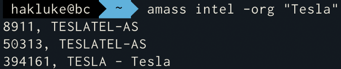
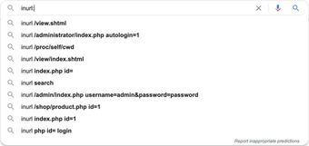

# FromStart

[https://twitter.com/fuxksniper/status/1285211285798322177](https://twitter.com/fuxksniper/status/1285211285798322177)

# Step 1

# Domain

(cheak Company Acquistions (means cheak for the root and seed domains) also cheak if the seed domain still own by the main domain owner or not 

[Crunchbase: Discover innovative companies and the people behind them](https://www.crunchbase.com/)

Using Bluto 

[darryllane/Bluto](https://github.com/darryllane/Bluto)

bluto -d [example.com](http://example.com/) -api 2b0ab19df982a783877a6b59b982fdba4b6c3669 -e

use email Hunter Api 

# Step 2

Every time you register a domain, you have to provide details about your company or
business, such as the name, phone number, mailing address, and specific email
addresses for technical and billing purposes. The domain registrar will also store the IP
address of your authoritative DNS servers.]

## whoxyrm

[MilindPurswani/whoxyrm](https://github.com/MilindPurswani/whoxyrm)

```glsl
whoxyrm -company-name "Oath Inc."
```

[https://viewdns](https://viewdns/).com

[https://tools.whoisxmlapi.com/reverse-whois-search](https://tools.whoisxmlapi.com/reverse-whois-search)

use These too to get Whois record and Every thing i mention below

oraganization,inc

asnnumber

domain mail address

## nmap

```glsl
nmap —script dns-brute —script-args dns-brute.domain=$domainnam
```

# Metabigor?

echo "company" | metabigor net --org -o /tmp/result.txt

[j3ssie/metabigor](https://github.com/j3ssie/metabigor)

> you Can Also check For Asn Whole Subnet without Any Api Key

# (Amass)

Read This hakluke write up on amass

[Hakluke's Guide to Amass - How to Use Amass More Effectively for Bug Bounties](https://medium.com/@hakluke/haklukes-guide-to-amass-how-to-use-amass-more-effectively-for-bug-bounties-7c37570b83f7)

```glsl
amass intel -org <company name here>

Mostly, it’s good for finding root domains and additional subdomains that belong to a company. It can do this in a number of ways. Firstly, there’s the “reverse whois” method.
```



```glsl
amass intel -active -asn <ASN Number Here>

If you want to find the ASN of a company, Amass can do a nice convenient search. For example, if I wanted to find ASN’s associated with Tesla, I could use this:
```


```glsl

amass intel -active -cidr <CIDR Range Here>

it pulls the SSL certificate from every IP address within the IP range and then spits back the domain that the SSL cert is associated with
```


```glsl

amass intel -whois -d <Domain Name Here>

Essentially it takes the details from the specified domain’s whois records, and then tries to find other domains with similar whois records.
```


Autonomous System Number (ASN) such as: IP owner, registration date, issuing registrar and the max range of the ASN with total IPs. Enter an ASn number, IP address, or a Company name or [Email@company.com](mailto:Email@company.com) or domain inc.

with this tool  you will get every thing <3

[Sicks3c/Reconizer](https://github.com/Sicks3c/Reconizer)

# Step 3

## SUBDOMAIN ENUMARTION

[https://twitter.com/pdnuclei/status/1289133795413811201](https://twitter.com/pdnuclei/status/1289133795413811201)

### Gather Lots OF Subdomains With The Help Of Amass know YOU Can Use some More Tools To get Some more Subdomains Domains

Tools

[aboul3la/Sublist3r](https://github.com/aboul3la/Sublist3r)

[projectdiscovery/subfinder](https://github.com/projectdiscovery/subfinder)

[https://chaos.projectdiscovery.io/#/](https://chaos.projectdiscovery.io/#/)

[OWASP/Amass](https://github.com/OWASP/Amass)

A Fully Automatic recon Framework

[j3ssie/Osmedeus](https://github.com/j3ssie/Osmedeus)

[codingo/Reconnoitre](https://github.com/codingo/Reconnoitre)

> Subdomain Enumaration(subdomains found try to remove the dead once with the help of Resolveing

### Resolve the domain list with filter resolved or Massdns or livetargetfinder )

Note If YOU Have Any Other Tools Dm me I will Add Those too in the list 

[tomnomnom/hacks](https://github.com/tomnomnom/hacks/tree/master/filter-resolved)

[allyomalley/LiveTargetsFinder](https://github.com/allyomalley/LiveTargetsFinder)

[blechschmidt/massdns](https://github.com/blechschmidt/massdns)

[SecurityTrails | The World's Largest Repository of Historical DNS data](https://securitytrails.com/)

### Also use  gospider or Gau for finding subdomain

[lc/gau](https://github.com/lc/gau)

[jaeles-project/gospider](https://github.com/jaeles-project/gospider)

Then Again Run the Subdomain tools on the live One and repeat the resolve step again to resolve 

```glsl
Note(if you Found A 404 domain show no access to the data try to run Wayback some Time You can Get some Fruitful things 

```

# Step 4

# **Subdomain Brute Force**

Subdomain Brute Force is a Tecnique where You Can find The root Domain hidden from normal Access Using 

[projectdiscovery/shuffledns](https://github.com/projectdiscovery/shuffledns)

```elixir
shuffledns -d [http://site.com](http://site.com/) -w wordlist -r resolver.txt -o output
```

Run a brute force with some custom options:

[blark/aiodnsbrute](https://github.com/blark/aiodnsbrute)

```elixir
$ aiodnsbrute -w wordlist.txt -vv -t 1024 [domain.com](http://domain.com/)
```

## Altdns

[infosec-au/altdns](https://github.com/infosec-au/altdns)

```elixir
echo -e "######Starting Bruteforce######\n"
altdns -i all.txt -o data_output -w /root/tools/Recon /recon/patterns.txt -r -s results_output.txt
```

## Dnsgen

[ProjectAnte/dnsgen](https://github.com/ProjectAnte/dnsgen)

 is  a good one 

```elixir
cat domains.txt | dnsgen - | massdns -r /path/to/resolvers.txt -t A -o J --flush 2 
```

also use 

## subrute

[TheRook/subbrute](https://github.com/TheRook/subbrute)

```elixir
#Fastest is Probably SubBrute.py
python $Tools/subbrute/subbrute.py paypal.com paypal.co.uk -t all.txt
```

## Also Go For Virtual Host Discovery

[Accessing Localhost via Vhost | VIRTUAL HOST ENUMERATION](https://blog.securitybreached.org/2017/11/04/access-localhost-via-virtual-host-virtual-host-enumeration/)

## Vhostdiscory

[jobertabma/virtual-host-discovery](https://github.com/jobertabma/virtual-host-discovery)

[codingo/VHostScan](https://github.com/codingo/VHostScan)

## FFUF

```elixir
ffuf -w subdomains.txt -u [http://website.com/](http://website.com/) -H “Host: [FUZZ.website.com](http://fuzz.website.com/)”
```


## Namp

```elixir
nmap --script http-vhosts -p 80,8080,443 <target>
```

# Get (rid of) Wildcard Domains

[thelikes/gwdomains](https://github.com/thelikes/gwdomains)

Brute force sub domains (knock,amass,fierce,subfinder,etc)
Run a mutator (dnsgen,syborg,etc)
Resolve the mutations
Feed gwdomains the mutated sub domains
Run
cat mutated.txt | gwdomains

# Note

- [ ]  Then Resolve These Output subdomain with

```jsx
 liveTargetFinder 
```

# Step 5

## Fingerprint

# Cms

[https://whatcms.org/](https://whatcms.org/)

## Identify the Cms  then use the Scanner)FOR Wordpress Site use `WPScan`|for `drupal joomla scanner`

[Dionach/CMSmap](https://github.com/Dionach/CMSmap)

[wpscanteam/wpscan](https://github.com/wpscanteam/wpscan)

[rezasp/joomscan](https://github.com/rezasp/joomscan)

[thomashartm/burp-aem-scanner](https://github.com/thomashartm/burp-aem-scanner)

## Use Nikto for every fingerprinting subdomain You Have in Your Found List

Nikto  

```elixir
nikto -h <ip> or <domainname> -ssl (ssl enable website)
```

## WafW00f It Detect Which Firewall is the Website using

```jsx
wafw00f <domainname>

```

web application firewalls

[EnableSecurity/wafw00f](https://github.com/EnableSecurity/wafw00f)

NMAP

```elixir
You can Also Use Nmap for Detecting WAF

 nmap -p 80,443 --script=http-waf-detect <domainname>
```

## | whatweb

WhatWeb identifies websites. Its goal is to answer the question, "What is that Website?". WhatWeb recognises web technologies including content management systems (CMS), blogging platforms, statistic/analytics packages, JavaScript libraries, web servers, and embedded devices. WhatWeb has over 1800 plugins, each to recognise something different. WhatWeb also identifies version numbers, email addresses, account IDs, web framework modules, SQL errors, and more.

[urbanadventurer/WhatWeb](https://github.com/urbanadventurer/WhatWeb)

```jsx
whatweb <domainname>
```

## Builthwith

### Chrome Extention

[https://builtwith.com/](https://builtwith.com/)

Identify The Tecnology Of the Website 

### Wapplayzer

Chrome Extention it Also Identify The Tecnology 

Once You Identify the tecnology 

### Cname

Identify The Cname of Every subdomain for the takeover (also look for nameserver domain | and Mailserver domain) takeover

# `Step 6`

### Crawling

Tip: Never forget to look for hidden parameters in the source code. click view source code and search for “hidden”, “input”, or “var” parameters.

(Basic Crawling  a website is typically one of the first places to start once you have discovered the live endpoints. It basically involves recursively visiting and saving each link on a website)

> ***Scan The List of Live URL you found Above in step 3 $ 4***

During Crawling You Will Found Alots of Endponts use Gf Tomnomnom and search for differnt parameters 

[1ndianl33t/Bug-Bounty-Roadmaps](https://t.co/ODoSQlRrBd?amp=1)

### ( Linked And Js Discovery "End Points | Looking For JS File And search For    keys password and config Files"
Grep Endpoint from Js File  cheak the status of the JavaScript files using hakcheckurl |use JS Beautifier for reading the js file)

### Gospider

[jaeles-project/gospider](https://github.com/jaeles-project/gospider)

```glsl
gospider -s "[https://google.com/](https://google.com/)" -o output -c 10 -d 1
gospider -S sites.txt -o output -c 10 -d 1
```

### Gau

[lc/gau](https://github.com/lc/gau.git)

```glsl
gau [example.com](http://example.com/)
```

[KathanP19/JSFScan.sh](https://github.com/KathanP19/JSFScan.sh)

### Secreat Finder

[m4ll0k/SecretFinder](https://github.com/m4ll0k/SecretFinder)

### Subdominzer

# Step 7

## Screen Shot

# Eyewitness

EyeWitness is designed to take screenshots of websites provide some server header info, and identify default credentials if known.

[FortyNorthSecurity/EyeWitness](https://github.com/FortyNorthSecurity/EyeWitness)

```
./EyeWitness -f urls.txt --web

./EyeWitness -x urls.xml --timeout 8 

./EyeWitness.py -f urls.txt --web --proxy-ip 127.0.0.1 --proxy-port 8080 --proxy-type socks5 --timeout 120
```

### Aquatone

$$cat hosts.txt | aquatone -out ~/aquatone/example.com$$

[michenriksen/aquatone](https://github.com/michenriksen/aquatone)

# Step 8

### Github Recon

### Tools

[tillson/git-hound](https://github.com/tillson/git-hound)

[hisxo/gitGraber](https://github.com/hisxo/gitGraber)

[michenriksen/gitrob](https://github.com/michenriksen/gitrob)

Use 

[shhhhhhh](https://gist.github.com/jhaddix/1fb7ab2409ab579178d2a79959909b33)

## Manual

[Github OSINT](https://medium.com/@ghostlulzhacks/github-osint-1e8a96f9fdb8)

```glsl
filename:sftp-config.json password.
filename:.env MAIL_HOST=smtp.gmail.com
filename:.npmrc _auth
filename:.dockercfg auth
extension:pem private
extension:ppk private
filename:id_rsa or filename:id_dsa
extension:sql mysql dump
extension:sql mysql dump password
filename:credentials aws_access_key_id
filename:.s3cfg
filename:wp-config.php
filename:.htpasswd
filename:.env DB_USERNAME NOT homestead
filename:.env MAIL_HOST=smtp.gmail.com
filename:.git-credentials
*"target(.)com" password
*"target(.)com" "pass" 'email'
*"target(.)com" "api"
*"target(.)com" FTP
*"target(.)com" SMTP
*"target(.)com" LDAP
*"target(.)com" PEM (For Keys)
"[http://hackerb0y.com](http://hackerb0y.com/)" "password"
"[http://hackerb0y.com](http://hackerb0y.com/)" "database"
"[http://hackerb0y.com](http://hackerb0y.com/)" "secret"
"[http://hackerb0y.com](http://hackerb0y.com/)" "api_key"
"site . com" ssh language:yaml
Got config.yaml
```

If You found Any Git file return 404 try this tool 

[lijiejie/GitHack](https://t.co/FzXHh15Fco?amp=1)

## Google Dorks

site:[http://ideone.com](http://ideone.com/) | site:[http://codebeautify.org](http://codebeautify.org/) | site:[http://codeshare.io](http://codeshare.io/) | site:[http://codepen.io](http://codepen.io/) | site:[http://repl.it](http://repl.it/) | site:[http://justpaste.it](http://justpaste.it/) | site:[http://pastebin.com](http://pastebin.com/) | site:[http://jsfiddle.net](http://jsfiddle.net/) | site:[http://trello.com](http://trello.com/) "[alibaba.com](http://alibaba.com/)

### Google Dork for API hacking You can always find updated dork list from [https://github.com/mrnitesh/WSDL/blob/master/dork.txt](https://github.com/mrnitesh/WSDL/blob/master/dork.txt)




Dork:

```elixir

"Url" filename:automation password passwd pass
```

```elixir
intitle:"index of" "ssh.yml"
intitle:"index of" "database-old.yml"
intitle:"index of" "configuration.yml"
intitle:"index of" "database.yml"
intitle:"index of" "ftp.yml"

Another Dork
"target . com" sshpass
Remove space :)
Note: Target must have oarge scope. Good chances to get juicy information
Best URL:
[https://google.com/search?q=how+to:+your%20question+here…](https://t.co/CGePSfMcvK?amp=1)
```

# Step 9

### Go For Subdomain Takeover

[A Guide To Subdomain Takeovers](https://www.hackerone.com/blog/Guide-Subdomain-Takeovers)

## DNSPROBE

[projectdiscovery/dnsprobe](https://github.com/projectdiscovery/dnsprobe)

Take The List Of Subdomains And Check For The Cname with dnsprobe

```elixir
dnsprobe -r cname Mx NS  
```

## Get A List of Subdomain YOu Found In the Step 3 and Run some Subdomain takeover tools Againts the list of subdomains

[haccer/subjack](https://github.com/haccer/subjack)

Also Go For NameServer Domain | Mail Server domain 

[mandatoryprogrammer/TrustTrees](https://github.com/mandatoryprogrammer/TrustTrees)

[https://digi.ninja/files/bucket_finder_1.1.tar.bz2](https://digi.ninja/files/bucket_finder_1.1.tar.bz2)

echo "[+] S3 Bucket Scanner [+]"

[sa7mon/S3Scanner](https://github.com/sa7mon/S3Scanner)

echo "[+] TKO-SUBS for Subdomain TKO [+]"

[anshumanbh/tko-subs](https://github.com/anshumanbh/tko-subs)

## Nuclei

TAKEOVER TEMPALTE

[projectdiscovery/nuclei](https://github.com/projectdiscovery/nuclei)

## Subover

[Ice3man543/SubOver](https://github.com/Ice3man543/SubOver)

# Step 10

Nuclei  NEW CVE(use Nuclei)

[projectdiscovery/nuclei](https://github.com/projectdiscovery/nuclei)

Run This Tools Templates Against the Websites Found during Recon 

# Step 11

# Directory Brute Force Wordlist

Try to Use A Good Word List  or Use | Raftsmall | jhadix all.txt | RobotsDisallowed1000.txt

[danielmiessler/SecLists](https://github.com/danielmiessler/SecLists/tree/master/Discovery/DNS)

## Directory Brute Forceing using

dirsearch

[maurosoria/dirsearch](https://github.com/maurosoria/dirsearch)

```elixir
python3 [dirsearch.py](http://dirsearch.py/) -e conf,config,bak,backup,swp,old,db,sql,asp,aspx,aspx~,asp~,py,py~,rb,rb~,php,php~,bak,bkp,cache,cgi,conf,csv,html,inc,jar,js,json,jsp,jsp~,lock,log,rar,old,sql,sql.gz,[http://sql.zip](http://sql.zip/),sql.tar.gz,sql~,swp,swp~,tar,tar.bz2,tar.gz,txt,wadl,zip,.log,.xml,.js.,.json -u [https://coderedmarketing.eccouncil.org/](https://coderedmarketing.eccouncil.org/) -t 100 -w /root/tools/bruteforce/ffufplus/wordlist/dicc.txt -b
```

## FFUF

Use Ffuf plus For directory Brute Force With Defult Word List 

[ffuf/ffuf](https://github.com/ffuf/ffuf)

# `(also brute force login page maintarget and there others page too )`

[dark-warlord14/ffufplus](https://github.com/dark-warlord14/ffufplus)

WFUZZ

[xmendez/wfuzz](https://github.com/xmendez/wfuzz)

# STEP 12

# ParaMeter Discovery

 Arjun 

```elixir
python3 [arjun.py](http://arjun.py/) -u [https://api.example.com/endpoint](https://api.example.com/endpoint) --get
```

[s0md3v/Arjun](https://github.com/s0md3v/Arjun/wiki/Usage#scanning-a-single-url)

Ffuf

Use Ffuf Plus For Parameter Finding 

Defualt option 

[dark-warlord14/ffufplus](https://github.com/dark-warlord14/ffufplus)

## PARAMSPIDER

[devanshbatham/ParamSpider](https://github.com/devanshbatham/ParamSpider)

```glsl
python3 [paramspider.py](http://paramspider.py/) --domain [bugcrowd.com](http://bugcrowd.com/) --exclude woff,css,js,png,svg,php,jpg --output bugcrowd.txt
```

> we Have Also Collected some end points During the Perivous Step also combine Both of them and go for the hunt

`**For Finding Hidden parameter And endpoints**`

# STEP 13

# Port Scan

[projectdiscovery/naabu](https://github.com/projectdiscovery/naabu)

[Docker Hub](https://hub.docker.com/r/koutto/jok3r/)

[vesche/scanless](https://github.com/vesche/scanless)

```elixir
sudo nmap -sS -T4 -sC -oA myreportname — stylesheet [https://raw.githubusercontent.com/honze-net/nmap-bootstrap-xsl/master/nmap-bootstrap.xsl](https://raw.githubusercontent.com/honze-net/nmap-bootstrap-xsl/master/nmap-bootstrap.xsl) -iL subdomain.txt
nmap –script smtp-enum-users.nse
nmap -vv -p0- -sSUV -O -oA

Nmap -sV -sC -v -T4 --script http-shellshock -p 443,80 <target>
nmap -vv -p0- -sSUV -O -oA $outputfile $targe
nmap -sV --script "discovery, vuln, not (brute or dos)" --script-timeout 30m --host-timeout 35m -T4 <TARGETGOESHERE> -oA <OUTPUTFILENAMEHERE>
```

This Script Will Automate All YOUR PORT SCANNING

Using Nmap or Massscan 

[KathanP19/portscan.sh](https://github.com/KathanP19/portscan.sh)

> Pass The Result To Brutespray for bruteforceing SSH services,FTP SMTP AND some Others

## Brutespray

[x90skysn3k/brutespray](https://github.com/x90skysn3k/brutespray)

```glsl
python [brutespray.py](http://brutespray.py/) --file nmap.gnmap
```

# TOP 10 OWASP VULNERBILTIES

# Crawling

Use This Scanner and cheak for owasp vulnerbilties

[pikpikcu/XRCross](https://github.com/pikpikcu/xrcross)

Tips

```jsx
if a site uses
1 **AngularJS,**
 test {{7*7}} to see whether 49 is rendered anywhere.
If the application is built with [ASP.NET](http://asp.net/) with XSS protection
enabled, you might want to focus on testing other vulnerability
types first and check for XSS as a last resort.
If a site is built with 
2 Rails,
 you might know that URLs
typically follow a /CONTENT_TYPE/RECORD_ID pattern, where the
RECORD_ID is an autoincremented integer. Using HackerOne as
an example, report URLs follow the pattern
[www.hackerone.com/reports/12345](http://www.hackerone.com/reports/12345). Rails applications
commonly use integer IDs, so you might prioritize testing
insecure direct object reference vulnerabilities because this
vulnerability type is easy for developers to overlook.
If an API returns 
3 :***JSON or XML***
, you might recognize that
those API calls unintentionally return sensitive information
that isn’t rendered on the page. Those calls might be a good
testing surface and could lead to information disclosure
vulnerabilities.
Here are some factors to keep in mind at this stage:
Content formats a site expects or accepts For example,
XML files come in different shapes and sizes, and XML
parsing can always be associated with XXE vulnerabilities.
Keep an eye out for sites that accept .docx, .xlsx, .pptx, or
other XML file types.
Third-party tools or services that are easily
misconfigured Whenever you read reports about hackers
exploiting such services, try to understand how those
reporters discovered the vulnerability and apply that
process to your testing.
Encoded parameters and how an application handles
them Oddities might be indicative of multiple services
interacting in the backend, which could be abused.
Custom implemented authentication mechanisms, such
as OAuth flows Subtle differences in how an application
handles redirect URLs, encoding, and state parameters
might lead to significant vulnerabilities.
```

Use This To Find Some Cool Stuff

[ethicalhackingplayground/Zin](https://github.com/ethicalhackingplayground/Zin)

Google Dorks (also use for ssrf xss information disclosure and buckets misconfigration)

### Spf Record

[Chainlink disclosed on HackerOne: No Valid SPF Records.](https://hackerone.com/reports/629087)

### Cors Misconfigration (gf cors,corsme scanner)

One Liners  For Cors

```glsl
cors_reflect_auto(){
        gau $1 | while read url;do target=$(curl -s -I -H "Origin: https://evil.com" -X GET $url) | if grep 'https://evil.com'; then [Potentional CORS Found]echo $url;$url;else echo Nothing on "$url";fi;done
}
cors_null_origin(){
        gau $1 | while read url;do target=$(curl -s -I -H "Origin: null" -X GET $url) | if grep 'Access-Control-Allow-Origin: null'; then echo [Potentional CORS Found] "$url"; else echo Nothing on: "$url";fi;done

}
cors_null_value(){
        gau $1 | while read url;do target=$(curl -s -I -X GET "$url") | if grep 'Access-Control-Allow-Origin: null'; then echo [Potentional CORS Found] "$url"; else echo Nothing on: "$url";fi;done
}
cors_trust_subdomain(){
        gau $1 | while read url;do target=$(curl -s -I -H "Origin: evil.$url" -X GET "$url") | if grep 'Access-Control-Allow-Origin: null'; then echo [Potentional CORS Found] "$url"; else echo Nothing on: "$url";fi;done
}
cors_domain_not_valid(){
        gau $1 | while read url;do target=$(curl -s -I -H "Origin: https://not$site" -X GET "$url") | if grep 'Access-Control-Allow-Origin: https://not$site'; then echo [Potentional CORS Found] "$url"; else echo Nothing on: "$url";fi;done
}
cors_dom_ext(){
        gau $1 | while read url;do target=$(curl -s -I -H "Origin: $site.evil.com" -X GET "$url") | if grep "Origin: Access-Control-Allow-Origin: $site.evil.com";  then echo [Potentional CORS Found] "$url"; else echo Nothing on: "$url";fi;done
}
```

[Shivangx01b/CorsMe](https://github.com/Shivangx01b/CorsMe)

Email Header Injection on Reset Password Function

[Mavenlink disclosed on HackerOne: Password reset link injection...](https://hackerone.com/reports/281575)

### SMTP Injection And Host Header Injection

[LocalTapiola disclosed on HackerOne: SMTP configuration...](https://hackerone.com/reports/183548)

[New Relic disclosed on HackerOne: Host Header Injection](https://hackerone.com/reports/698416)

[Boozt Fashion AB disclosed on HackerOne: Email link poisoning /...](https://hackerone.com/reports/182670)

## IFrame ClickJacking

[Gratipay disclosed on HackerOne: Bypassing X-frame options](https://hackerone.com/reports/283951)

[OLX disclosed on HackerOne: Bypass CSP frame-ancestors at...](https://hackerone.com/reports/371980)

## Improper Access Control

[Vend VDP disclosed on HackerOne: Improper access control on adding...](https://hackerone.com/reports/317332)

[GitLab disclosed on HackerOne: Attacker is able to access commit...](https://hackerone.com/reports/502593)

## Parameter Tempering

[WordPress disclosed on HackerOne: Parameter tampering : Price...](https://hackerone.com/reports/682344)

[Shipt disclosed on HackerOne: Price manipulation via fraction...](https://hackerone.com/reports/388564)

## **HTTP PARAMETER POLLUTION**

[HackerOne disclosed on HackerOne: HTTP Parameter Pollution using...](https://hackerone.com/reports/298265)

[Slack disclosed on HackerOne: HTTP parameter pollution from...](https://hackerone.com/reports/335339)

# TEMPLATE INJECTION

[Shopify disclosed on HackerOne: H1514 Server Side Template...](https://hackerone.com/reports/423541)

[Unikrn disclosed on HackerOne: Urgent: Server side template...](https://hackerone.com/reports/164224)

[Rockstar Games disclosed on HackerOne: Client-side Template...](https://hackerone.com/reports/271960)

# OAUTH VULNERABILITIES

[TTS Bug Bounty disclosed on HackerOne: Stealing Users OAuth Tokens...](https://hackerone.com/reports/665651)

[BOHEMIA INTERACTIVE a.s. disclosed on HackerOne: Stealing Users...](https://hackerone.com/reports/405100)

# Broken Link Cheak

[GitLab disclosed on HackerOne: Impersonation attack via Broken Link...](https://hackerone.com/reports/266908)

[Legal Robot disclosed on HackerOne: Broken links for stale domains...](https://hackerone.com/reports/276244)

[Gratipay disclosed on HackerOne: Broken link for stale DNS entry...](https://hackerone.com/reports/279351)

[Gratipay disclosed on HackerOne: Broken link for stale DNS entry...](https://hackerone.com/reports/279351)

# CSRF Login And Logout\

Tool

xsrfprobe --help

[WakaTime disclosed on HackerOne: Logout CSRF](https://hackerone.com/reports/244778)

[HackerOne disclosed on HackerOne: (HackerOne SSO-SAML) Login CSRF,...](https://hackerone.com/reports/171398)

# SQL Header based And Cookie Based

[Instacart disclosed on HackerOne: Cookie-Based Injection](https://hackerone.com/reports/105419)

[Zomato disclosed on HackerOne: [https://reviews.zomato.com] Time...](https://hackerone.com/reports/300176)

[Paragon Initiative Enterprises disclosed on HackerOne: Blind SQL INJ](https://hackerone.com/reports/115304)

SSRf  (Finding SSRF Parameter Using Hunt Brup Pulgin or  gf  ,json (against The crawl Data  U Found at The Crawling step  )  

[Node.js third-party modules disclosed on HackerOne: Server-Side...](https://hackerone.com/reports/793704)

[TTS Bug Bounty disclosed on HackerOne: SSRF in Search.gov via ?url=...](https://hackerone.com/reports/514224)

# Xss

Easy Automation XSS Tip

cat subdomains.txt | waybackurls >> wayback.txt

cat subdomains.txt | hakrawler -depth 3 -plain >> spider.txt

cat spider.txt wayback.txt | kxss == XSS $$$

 ( Using Hunt Brup Pulgin or Shive gf json  (against The crawl Data  U Found at The Crawling step) File or Some One liners  

[Top 25 XSS Bug Bounty Reports](https://medium.com/@corneacristian/top-25-xss-bug-bounty-reports-b3c90e2288c8)

[Twitter disclosed on HackerOne: Stored XSS on reports.](https://hackerone.com/reports/485748)

[HackerOne disclosed on HackerOne: Reflected XSS on...](https://hackerone.com/reports/840759)

## Cheak Cryptograpy in Reset Function

[Revive Adserver disclosed on HackerOne: Authentication Bypass by...](https://hackerone.com/reports/576504)

[Uber disclosed on HackerOne: Issue with Password reset functionality](https://hackerone.com/reports/92251)

# Unicode injection in Email Parameter @

[Unikrn disclosed on HackerOne: HTML injection in email in unikrn.com](https://hackerone.com/reports/262004)

[HackerOne disclosed on HackerOne: mailto: link injection on...](https://hackerone.com/reports/66262)

# Bypassing Rate Limit

Headers:- X-originating-IP:ip
| X-Forwarded-FOR:ip
| X-Remote-IP:ip
| X-Remote-Addr
| X-Client-IP:ip
| X-Forwarded-Host:ip)

[Slack disclosed on HackerOne: Rate-limit bypass](https://hackerone.com/reports/165727)

[HackerOne disclosed on HackerOne: Bypass rate limiting on...](https://hackerone.com/reports/170310)

# Request Smuggling

[Brave Software disclosed on HackerOne: HTTP Request Smuggling](https://hackerone.com/reports/866382)

[Slack disclosed on HackerOne: Mass account takeovers using HTTP...](https://hackerone.com/reports/737140)

[defparam/smuggler](https://github.com/defparam/smuggler)

# RCE

[Top 25 RCE Bug Bounty Reports](https://medium.com/@corneacristian/top-25-rce-bug-bounty-reports-bc9555cca7bc)

# Open Redirect using (wayback gau gosipder)

[Hanno's projects disclosed on HackerOne: Open redirect on...](https://hackerone.com/reports/373916)

[Twitter disclosed on HackerOne: XSS and Open Redirect on MoPub Login](https://hackerone.com/reports/683298)

# Socail-Signon Bypass

[Uber disclosed on HackerOne: Authentication bypass on auth.uber.com...](https://hackerone.com/reports/219205)

[Genasys Technologies disclosed on HackerOne: Ability to bypass...](https://hackerone.com/reports/729960)

[Automattic disclosed on HackerOne: Authentication Bypass - Chaining...](https://hackerone.com/reports/209008)

[New Relic disclosed on HackerOne: SSO Authentication Bypass](https://hackerone.com/reports/168108)

# File Upload

 leads to CSRF,SSRF,xss,LFI,XXE,RCE(fuxuploader or manual detection)

[Stripo Inc disclosed on HackerOne: Unrestricted File Upload on...](https://hackerone.com/reports/823588)

[SEMrush disclosed on HackerOne: Unrestricted file upload in...](https://hackerone.com/reports/748903)

[Qulture.Rocks disclosed on HackerOne: Unrestricted File Upload in...](https://hackerone.com/reports/826288)

# XEE Injection xml entity injection

[QIWI disclosed on HackerOne: [send.qiwi.ru] Soap-based XXE...](https://hackerone.com/reports/36450)

[Starbucks disclosed on HackerOne: XXE at...](https://hackerone.com/reports/500515)

[DuckDuckGo disclosed on HackerOne: XXE on https://duckduckgo.com](https://hackerone.com/reports/483774)

[drchrono disclosed on HackerOne: XML Parser Bug: XXE over which...](https://hackerone.com/reports/55431)

# [Web Cache Posning](https://hackerone.com/reports/280914)

[Postmates disclosed on HackerOne: Web cache poisoning attack leads...](https://hackerone.com/reports/492841)

[HackerOne disclosed on HackerOne: Denial of service via cache...](https://hackerone.com/reports/409370)

[Nextcloud disclosed on HackerOne: https://help.nextcloud.com::: Web...](https://hackerone.com/reports/429747)

# Bussiness Logic Error

[Shopify disclosed on HackerOne: Potential to abuse pricing errors...](https://hackerone.com/reports/336131)

[HackerOne disclosed on HackerOne: Account recovery text message is...](https://hackerone.com/reports/549364)

[Inflection disclosed on HackerOne: Business Logic Flaw allowing...](https://hackerone.com/reports/280914)

# Buffer overflow

[Valve disclosed on HackerOne: RCE on Steam Client via buffer...](https://hackerone.com/reports/470520)

[Liberapay disclosed on HackerOne: Buffer overflow](https://hackerone.com/reports/363658)

[Perl (IBB) disclosed on HackerOne: Integer overflow leading to...](https://hackerone.com/reports/424447)

[VLC (European Commission - DIGIT) disclosed on HackerOne: Buffer...](https://hackerone.com/reports/484398)

# Source Code Disclosure

[Rockstar Games disclosed on HackerOne: Source Code Disclosure (CGI)](https://hackerone.com/reports/211418)

[Razer disclosed on HackerOne: Source Code Disclosure](https://hackerone.com/reports/819735)

[Mail.ru disclosed on HackerOne: Source code disclosure](https://hackerone.com/reports/521960)

[Nextcloud disclosed on HackerOne: Business/Functional logic bypass:...](https://hackerone.com/reports/145745)

# Information disclosure

[Vanilla disclosed on HackerOne: Forum Users Information Disclosure](https://hackerone.com/reports/321249)

[Uber disclosed on HackerOne: Sensitive user information disclosure...](https://hackerone.com/reports/542340)

# Web-cache deception

[Chaturbate disclosed on HackerOne: Web cache deception attack -...](https://hackerone.com/reports/397508)

[SEMrush disclosed on HackerOne: Web cache deception attack - expose...](https://hackerone.com/reports/439021)

# RACE CONDITIONS

[Top 25 Race Condition Bug Bounty Reports](https://medium.com/@corneacristian/top-25-race-condition-bug-bounty-reports-84f9073bf9e5)

# APPLICATION LOGIC AND CONFIGURATION VULNERABILITIES

[Penetrating Pays: The Pornhub Story](https://blog.zsec.uk/pwning-pornhub/)

[HackerOne disclosed on HackerOne: AWS S3 bucket writeable for...](https://hackerone.com/reports/128088/)

[[BugBounty] Yahoo phpinfo.php disclosure](https://blog.it-securityguard.com/bugbounty-yahoo-phpinfo-php-disclosure-2/)

[HackerOne disclosed on HackerOne: Inadequate access controls in...](https://hackerone.com/reports/137503/)

[GitLab disclosed on HackerOne: Bypassing password authentication of...](https://hackerone.com/reports/128085/)

[Shopify disclosed on HackerOne: An administrator without any...](https://hackerone.com/reports/100938/)

[HackerOne disclosed on HackerOne: Improve signals in reputation](https://hackerone.com/reports/106305)

# IDOR

[Top 25 IDOR Bug Bounty Reports](https://medium.com/@corneacristian/top-25-idor-bug-bounty-reports-ba8cd59ad331)

[[Case Study] Bypassing IDOR via Parameter Pollution](https://medium.com/@0xgaurang/case-study-bypassing-idor-via-parameter-pollution-78f7b3f9f59d)

# Session Fixation

[Enter disclosed on HackerOne: Session Fixation](https://hackerone.com/reports/135797)

[Shopify disclosed on HackerOne: H1514 Session Fixation on multiple...](https://hackerone.com/reports/423136)

# GraphQL

[Shopify disclosed on HackerOne: H1514 [beerify.shopifycloud.com]...](https://hackerone.com/reports/419883)

[HackerOne disclosed on HackerOne: Confidential data of users and...](https://hackerone.com/reports/489146)

[HackerOne disclosed on HackerOne: Private information exposed...](https://hackerone.com/reports/645299)

[Discovering GraphQL endpoints and SQLi vulnerabilities](https://medium.com/@localh0t/discovering-graphql-endpoints-and-sqli-vulnerabilities-5d39f26cea2e)

## Tool

inql

[doyensec/inql](https://github.com/doyensec/inql)

[!] Remote GraphQL Endpoint OR a Schema file in JSON format must be specified!

# CRLF

[Twitter disclosed on HackerOne: CRLF injection](https://www.google.com/url?sa=t&rct=j&q=&esrc=s&source=web&cd=&ved=2ahUKEwihyITTl8HrAhVBKBoKHVh3D8QQFjAAegQIBRAB&url=https%3A%2F%2Fhackerone.com%2Freports%2F446271&usg=AOvVaw3C7xnZtbkmXvXmZ3v3zmNw)

[Snapchat disclosed on HackerOne: CRLF Injection at vpn.bitstrips.com](https://hackerone.com/reports/237357)

[Mail.ru disclosed on HackerOne: [dl.beepcar.ru] CRLF Injection](https://hackerone.com/reports/332708)

## Tool

Use BRUP

## crlf scanner

[rudSarkar/crlf-injector](https://github.com/rudSarkar/crlf-injector)

[MichaelStott/CRLF-Injection-Scanner](https://github.com/MichaelStott/CRLF-Injection-Scanner)

[dwisiswant0/crlfuzz](https://github.com/dwisiswant0/crlfuzz)

# Command Injection

[OS Command Injection Vulnerability](https://medium.com/@musyokaian/os-command-injection-vulnerability-22cc70e0e6a6)

[When i found multiple command injection](https://medium.com/bugbountywriteup/when-i-found-multiple-command-injection-ad891d3ad9e6)

[https://medium.com/bugbountywriteup/command-injection-poc-72cc3743f10d](https://medium.com/bugbountywriteup/command-injection-poc-72cc3743f10d)

command injection are as
follows:
Cookies
X-Forwarded-For
User-Agent
Referrer

Tool

[commixproject/commix](https://github.com/commixproject/commix)

# Broken Access Control Testing

[]()

[https://www.youtube.com/watch?reload=9&v=TJQpOrtet8E](https://www.youtube.com/watch?reload=9&v=TJQpOrtet8E)